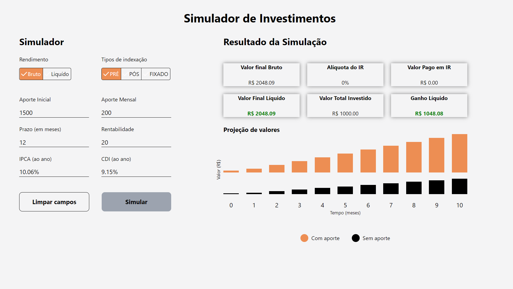
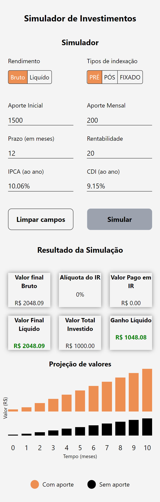

# Desafio Front-end

### Screenshot

### Screenshot - Mobile Version

### Construído com

-   React
-   Vite
-   JavaScript
-   TypeScript
-   Axios
-   TailwindCSS
-   React Hook Form
-   Yup
-   Tippy

A aplicação foi construída utilizando ReactJS com Typescript, por meio do Vite, com a
utilização do framework Tailwind para estilização.

Utilizei a biblioteca React Hook Form em conjunto com a Yup a fim de facilitar o controle
das informações a serem preenchidas pelo usuário nos inputs do formulário e exibir
mensagens de erro para cada input. Além das mensagens auxiliares de erro, a label e a
borda inferior do input ficam avermelhadas sinalizando ao usuáio onde corrigir.

Ao clicar no botão "Limpar campos" a aplicação apaga todos os inputs habilitados e reseta
os botões de rendimento e tipo de indexação para "Bruto" e "Pré", respectivamente.

Os inputs "IPCA (ao ano)" e "CDI (ao ano)" são desabilitados para alteração e são
preenchidos com os dados fornecidos pela Fake API, por meio do endpoint "GET
/indicadores".

Caso os inputs estejam todos preenchidos e o usuário clique no botão "Simular", a
aplicação realiza uma requisição com o método POST, via biblioteca Axios, para o endpoint
"GET /simulacoes", adicionando query strings na URL com as opções relativas aos botões de
rendimento e tipo de indexação.

Assim que a resposta é recepcionada, é renderizado o campo direito (na visualização
Desktop), exibindo Cards com os títulos e respectivos valores.

Abaixo, estão localizados dois gráficos construídos a partir da resposta da Fake API, em
que o tamanho das barras corresponde proporcionalmente à evolução do capital retornada.

Para tanto foi elaborado um cálculo, obtendo o valor do último mês a fim de calcular a
proporcionalidade deste com os demais meses na exibição das barras do gráfico.

O cálculo se deu da seguinte maneira:

(Valor no respectivo mês) - (valor no primeiro mês) / (valor no último mês) - (valor no
primeiro mês)

A partir desta divisão, multiplica-se o valor por 100 para chegar ao percentual do
respectivo mês, e este valor é utilizado para settar a altura da respectiva barra do
gráfico.

O gráfico de barras laranjas exibe a evolução do capital com aportes e o de barras pretas,
sem aportes.

Com o auxílio da biblioteca Tippy, quando o mouse for colocado sobre alguma das barras dos
gráficos será exibido um ToolTip com o valor respectivo, formatado para exibição com duas
casas decimais e a moeda corrente em reais.

### Como utilizar

Inicialmente, é preciso baixar a API construída para retornar as respostas às requisições
formuladas pela camada front-end, executar "npm install" e então "npx json-server
db.json".

Com a API em execução, será possível consumir seus endpoints com a camada front-end.

Para tanto, será preciso executar 'npm install' para instalar as dependências necessárias
do repositório front-end.

Após isso, execute 'npm run dev' no terminal para iniciar a aplicação.

## Autor

-   GitHub - Vinícius dos Santos Verissimo (https://github.com/viniciusdsv93)
